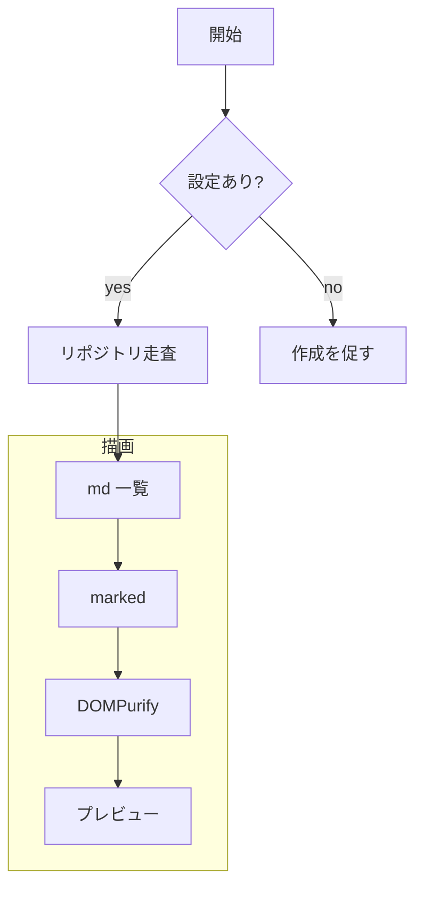
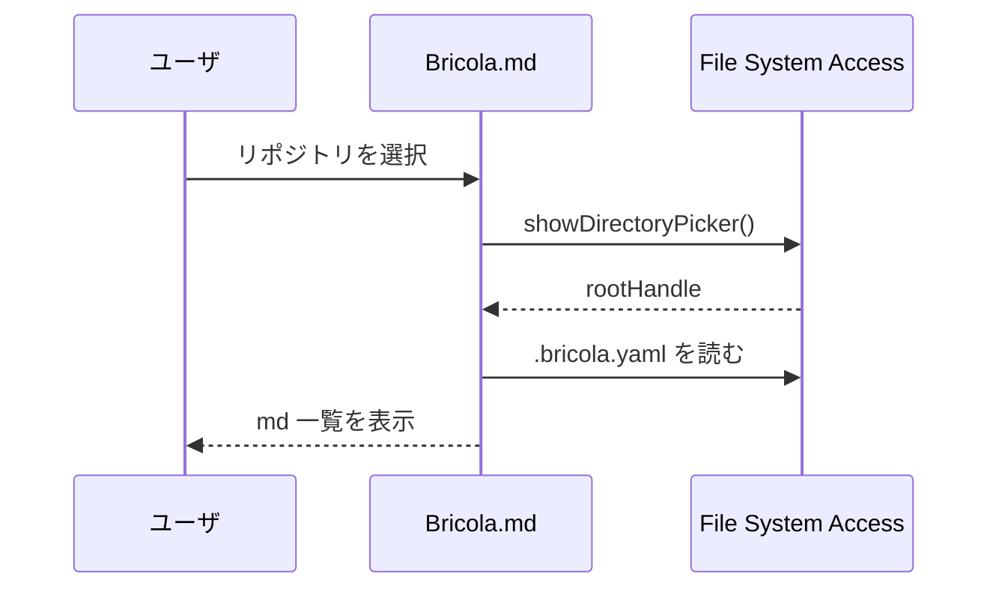
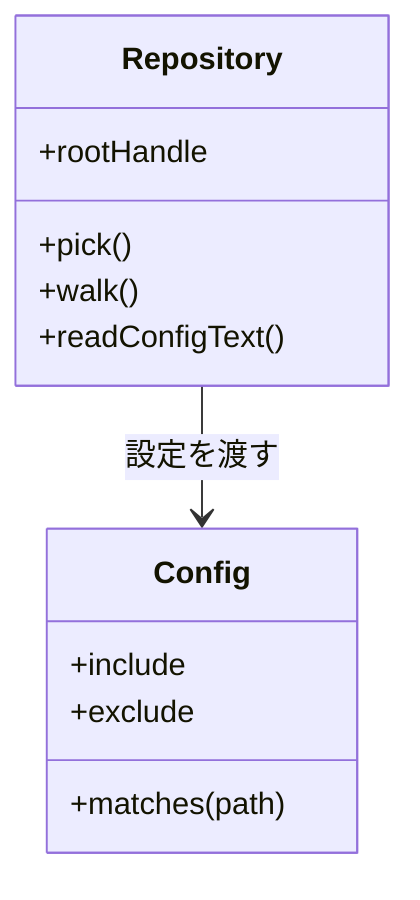
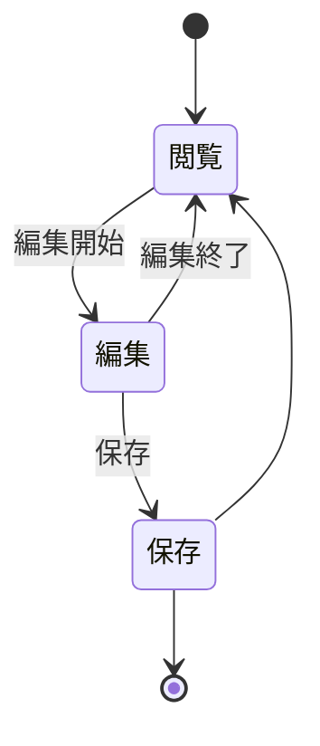
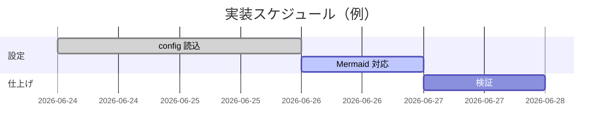
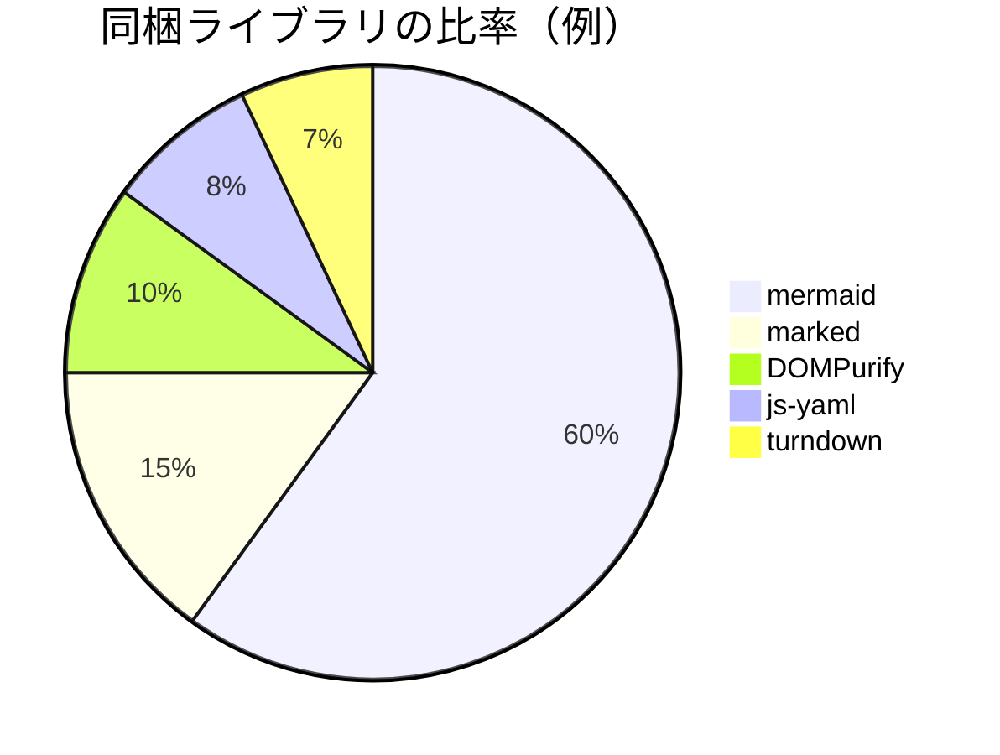

# Mermaid 動作確認

このファイルは Mermaid 描画（ADR-0012）と基本的な Markdown 表示の確認用。
プレビューで各図が SVG として表示されれば成功。**最後の節は意図的に壊した図**で、エラー表示（`.mermaid-error`）になれば成功。

## 1. フローチャート（subgraph 入り）



## 2. シーケンス図（foreignObject を含む / svg profile の確認）



## 3. クラス図



## 4. 状態遷移図



## 5. ガントチャート



## 6. 円グラフ



## 通常 Markdown の確認

### テーブル（操作 UI / ADR-0007）

| 要素 | 対応 | 備考 |
|------|:----:|------|
| 見出し | ✅ | アウトラインに反映 |
| テーブル | ✅ | 行列操作 |
| コード | ✅ | 下記 |

### コードブロック（mermaid 以外はそのまま表示）

```js
Bricola.mermaid.enhance(el.preview); // ADR-0012
```

### リスト・引用・強調

- 箇条書き 1
- 箇条書き 2
  - ネスト
1. 番号付き
2. 番号付き

> 引用ブロック。**太字** と *斜体* と `インラインコード`。

## 7. 意図的に壊した図（エラー表示の確認）

> ここは**わざと**構文を壊しています。図ではなく赤いエラー枠が出れば正常。

```mermaid
graph TD
  A -->
```
